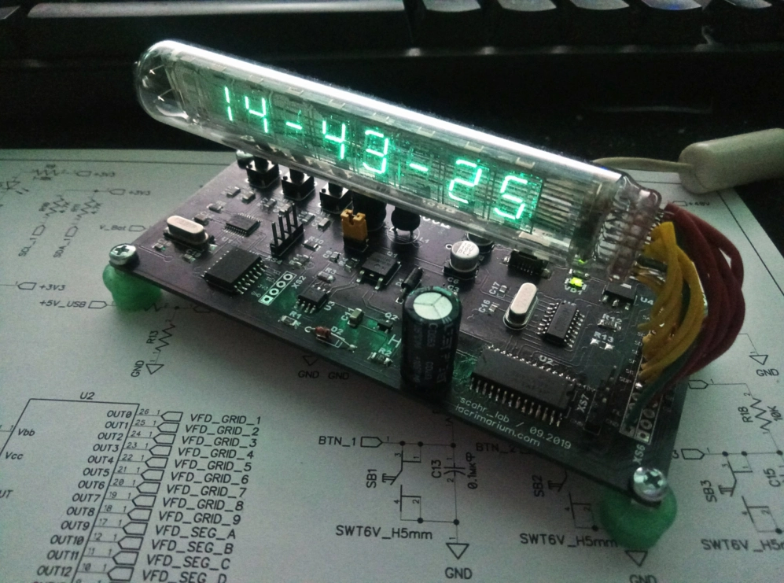

# SC IV-18 Clock

Настольные часы на советском вакуумно-люминесцентном индикаторе **ИВ-18**.
STM32F030 + MAX6921AWI + DS3231, питание от USB, повышающий преобразователь
на NE555, собственная плата. Проект 2019 года, часы собраны и работают.



---

Подробный разбор схемы и принципов работы — в статье на сайте:
**[0x0001 — ВЛИ (VFD) ИВ-18](https://coders-lair.com/articles/0x0001)**

## Железо

| Узел                        | Компонент        | Назначение                                     |
|-----------------------------|------------------|------------------------------------------------|
| Микроконтроллер             | STM32F030F4P6    | Управление индикацией, опрос RTC, UART         |
| VFD-драйвер                 | MAX6921AWI       | 20-канальный коммутатор сеток/сегментов, SPI   |
| Преобразователь анодного    | NE555 + IRFR024N | Boost 5В -> ~40В для питания анодов             |
| RTC                         | DS3231           | Термостабилизированные часы, I²C               |
| USB-UART                    | CH340G           | Связь с компьютером, отладочный вывод          |
| Индикатор                   | ИВ-18            | 8-разрядный ВЛИ, динамическая индикация        |
| Питание логики              | AMS1117-3.3      | 5В USB -> 3.3В для MCU                          |

Напряжение накала ИВ-18 подаётся непосредственно с USB через гасящий
резистор. Накал **не должен светиться** — иначе ресурс нити резко падает.

### Предупреждение

Повышающий преобразователь на выходе даёт около 40 В, и выходной
конденсатор сохраняет заряд некоторое время после обесточивания схемы.
При наличии кардиостимулятора или других проблем с сердцем работа
с этой схемой может быть опасна. Не прикасайтесь к токоведущим элементам
при включённом питании и сразу после выключения.

## Схема и плата

Схема и разводка выполнены в DipTrace.

- [schematics/sc_iv18_clock_schematic.pdf](schematics/sc_iv18_clock_schematic.pdf) — схема в PDF

Gerber-файлы в этом репозитории пока не опубликованы (затерялись).

## Прошивка

### Среда сборки

Проект создан в **STM32CubeIDE** (исходно версия 2019 года, совместим
с актуальными релизами). Для открытия:

1. `File` -> `Import` -> `Existing Projects into Workspace`
2. Выбрать корень этого репозитория
3. Build

Для работы с `.ioc` также потребуется STM32CubeMX (интегрирован в CubeIDE).

### Что реализовано

- [x] Динамическая индикация (8 разрядов × 7 сегментов + точка)
- [x] Режим отображения времени (`HH-MM-SS` с мигающими разделителями)
- [x] Режим отображения даты (`DD.MM.20YY`)
- [x] Режим отображения температуры DS3231 и дня недели (`NN°C   D`)
- [x] Автоматическое переключение режимов по таймауту
- [x] Переключение режимов вручную кнопкой BTN_3
- [x] Чтение времени/даты/температуры из DS3231 по I²C
- [x] Отладочный вывод через USB-UART (`#define USE_USART`)

### Статус и TODO

Текущая прошивка — **только отображение**. Установка времени и даты
выполняется через закомментированный вызов `DS3231_SetDateTime()` в `main()`
(см. `/* USER CODE BEGIN 2 */`): раскомментировать, прошить, дать часам
один раз синхронизироваться, закомментировать обратно, прошить повторно.

Пользовательская настройка часов через кнопки задумана, но не реализована:

- [ ] Обработка `BTN_1` — навигация по позициям внутри режима настройки
- [ ] Обработка `BTN_2` — инкремент/декремент значения на выбранной позиции
- [ ] Циклы режимов `MODE_SETTINGS_*` в основном цикле main loop
- [ ] Переход в режим настройки долгим нажатием `BTN_3`
- [ ] Сохранение настроек обратно в DS3231
- [ ] AT-команды (настройки/переключения режимов etc.)

Эти точки в коде помечены комментариями `TODO`.

## Структура репозитория

```
.
├── Inc/                   Заголовочные файлы прошивки
│   ├── ds3231.h           Драйвер DS3231 (I²C)
│   ├── xprintf.h          xprintf by ChaN (UART-форматирование)
│   └── ...                CubeIDE-generated
├── Src/                   Исходники прошивки
│   ├── main.c             Main loop + динамическая индикация + режимы
│   ├── ds3231.c           Реализация драйвера DS3231
│   ├── xprintf.c          xprintf by ChaN
│   └── ...                CubeIDE-generated
├── Drivers/               STM32 HAL и CMSIS (CubeIDE-generated)
├── startup/               startup_stm32f030x6.s
├── schematics/            Схема PDF-экспорт
├── docs/images/           Фото изделия
│
├── SC_IV18_CLOCK.ioc      CubeMX-проект
├── STM32F030F4_FLASH.ld   Линкер-скрипт
├── .clang-format          Стиль кода
└── LICENSE                MIT
```

## Стиль кода

Фиксирован в [.clang-format](.clang-format) в корне репозитория:

- 4-пробельный отступ, без табов
- Открывающая скобка на той же строке
- Параметры функций — построчно, если сигнатура не влезает в строку
- Сохраняется «колоночное» выравнивание в таблицах констант

Применить форматирование ко всему проекту:

```sh
find Inc Src -name '*.c' -o -name '*.h' | xargs clang-format -i
```

## Лицензия

[MIT](LICENSE).

Сторонний компонент `xprintf` (файлы `xprintf.c`, `xprintf.h`)
распространяется под собственной BSD-подобной лицензией — см. заголовок
внутри самих файлов.

## Автор

**Sergey Petrov** / [coder's lair](https://coders-lair.com/)

*MANV ET MENTE* — by hand and mind.
